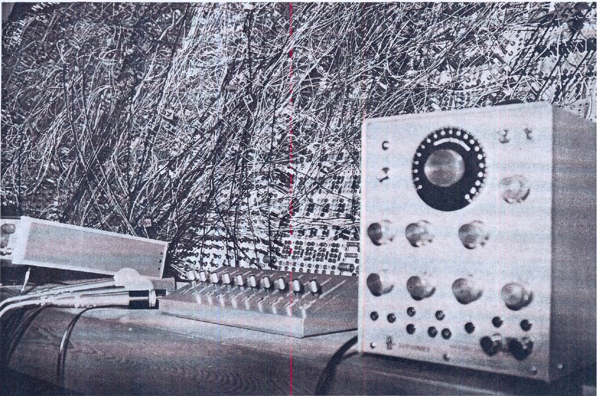
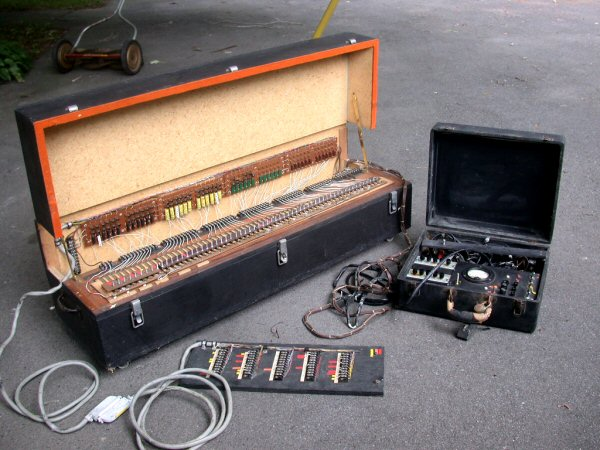
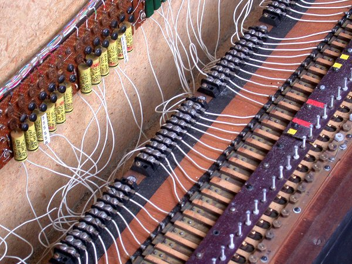

Introduction
============

1cm "Use the word 'cybernetics', Norbert, because nobody knows what it
means. This will always put you at an advantage in arguments."

1cm - attributed to Claude Shannon in a letter to Norbert Wiener[^1]\

Even the American Society for Cybernetics, ostensibly the institutional
authority on cybernetics, offers no fewer than **forty-six** definitions
of cybernetics as offered by various thinkers, artists, and scientists
associated with the field. Among them, in no particular
order:[^2]^,^[^3]

-   "The science of control and communication in the animal and the
    machine" (Norbert Wiener)

-   "\[Cybernetics\] tries to show that mechanisms of a feedback nature
    are the base of teleological or purposeful behavior in man-made
    machines as well as in living organisms, and in social systems."
    (Ludwig von Bertalanffy)

-   "Cybernetics treats, not things, but ways of behaving. It does not
    ask, 'What is this thing?' but 'what does it do?' " (W. Robert
    Ashby)

-   "Should one name one central concept, a first principle, of
    cybernetics, it would be circularity." (Heinz von Förster)

-   "Cybernetics is the awareness of the process that keeps phenomena in
    balance." (Nicolas Schöffer)

-   "The ability to cure all temporary truth of eternal triteness."
    (Herbert Brün)

The ambiguity of Herbert Brün's definition is particularly delightful,
even if it seems his faith in the strength of a single branch of science
is questionable. So, then, what is cybernetics? For the purposes of this
text, it will be aligned most closely with Wiener and von Bertalanffy's
definitions above but, as one will see, this is never quite so clear
cut. Nonetheless, once cybernetics took hold in the disciplines of
mathematics and physiology after the publication of Wiener's book
*Cybernetics: control and communication in the animal and machine* in
1948, it found its way into biology, engineering, and eventually the
arts. It is perhaps because of the wide application of the term that it
gathered such diverse definitions that, although implying different
perspectives, never contradict one another.

Heinz von Förster said it best: "That is the fascinating thing about
cybernetics. You ask a couple of people to give you a definition and
although you don't get to know much about cybernetics from them, you
find out a lot about the person supplying the definition, including
their area of expertise, their relation to the world, their desire to
play with metaphors, their enthusiasm for management, and their interest
in communications or message theory."[^4]

This paper will present a brief historical overview of Norbert Wiener's
cybernetics, as well as its conterpart systems aesthetics found in the
writing of sculptor and art theorist Jack Burnham. As a locus, it will
use David Tudor's *Bandoneon! (a combine)*, first performed at the *9
Evenings: Theatre & Engineering* in 1966 with help from Fred Waldhauer
from Bell Labs. It will not serve as a technical analysis of the piece
but rather present it as an early instatiation of the concepts found in
both cybernetics and systems aesthetics of which technical production is
a crucial component.

Cybernetics and Systems Aesthetics: an Overview
===============================================

It is not the purpose of this paper to provide a detailed summary of
either cybernetics nor systems aesthetics, but rather to show their
relationship to one another and their manifestations in artwork.
However, having at least a cursory understanding of both is critical for
the discussion that follows; thus, a brief overview.

Cybernetics
-----------

The word "cybernetics" often conjures up images of machines --- machines
plugged into machines, machines plugged into humans, a cyberpunk-like
orgy of cables, sweat, electricity, and blood.[^5] According to Merriam
Webster, cybernetics is defined as \"the science of communication and
control theory that is concerned especially with the comparative study
of automatic control systems (such as the nervous system and brain and
mechanical-electrical communication systems).\"[^6] It is, essentially,
the study of systems as they appear in animals and machines, and is a
precursor of sorts to Ludwig von Bertalanffy's general systems theory
which greatly influenced Jack Burnham's thoughts on systems aesthetics.

The term itself originated in Norbert Wiener's 1948 book *Cybernetics:
or control and communication in the animal and machine*. In this seminal
text, Wiener coins the term cybernetics and lays out what he sees as the
tennants of the field. Of the word, Wiener constucted it from the Greek
for *steersman*: \"We have decided to call the entire field of control
and communication theory, whether in the machine or in the animal, by
the name *Cybernetics*, which we derive from the Greek
$\chi\upsilon\beta\epsilon\rho\nu\eta\tau\eta\zeta$ (kybernetés) or
*steersman*.\" While Wiener acknowledges the fact that application of
the specific term cybernetics does not predate 1947, the concepts it
embodies surely predate the term and were touched on by Clerk Maxwell
and his article on *governors* in 1868.[^7]

The aspects of cybernetics this text will primarily concern itself with
are:

-   feedback

-   information

-   interdisciplinarity

### Feedback

Perhaps the most important concept in cybernetics is that of feedback,
wherein information from the output is in some proportion added to the
input before being recalculated. If there is no feedback in a system, it
cannot be responsive and would thus have no information about the way in
which its environment has changed, either by its own action or those
actions precipitated around it by something else. Critically, the nature
of the information contained in the feedback is based on its actual
performance at any given moment, not its expected performance at that
same moment.[^8]

Wiener provides the example of picking up a pencil. This action is
performeds automatically by the "will" in that one does not deliberately
and consciously contract, to a specific amount, the specific muscles
needed to pick it up. How, then, is this accomplished without thereby
overshooting or undershooting the object? There must, according to
Wiener, "be a report to the nervous system\... of the amount by which we
have failed to pick up the pencil at each instant."[^9] Further, the
"motion is regulated by some measure of the amount by which it has not
yet been accomplished."[^10] This report is visual (assuming the lights
are on and our eyes are open) but is more generally proprioceptive; that
is, kinesthetic in nature. The information which is gathered by the
nervous system is *feedback* and the brain responds appropriately.
Feedback, however, need not be the domain of a highly complex system
such as the human body or that of a guided missle system but can be
mechanically induced by the simple thermostat found in a home. This
device operates by virtute of its "sense organ" that is solely
thermoceptive: a two-sided band of metal expands and contracts with the
temperature. It is the responsibility of the thermostat to "check" where
the temperature is and to respond accordingly, either by turning on in
the case of too low a temperature, or by turning off, when the
temperature has reached a sufficiently high level.

From the idea that feedback is the proportion of that which has not yet
been accomplished, it follows that feedback, in this instance, must be
negative; that is, it opposes what the system is already doing and thus
serves to stabalize the system. This stability also known as
*homeostasis*. The question begs: what happens when the level of
feedback is insufficient than what is necessary to stabalize the system?
How does the system respond?

#### Oscillation or "hunting"

Oscillation, or what Wiener calls *hunting*, is a natural consequence of
feedback in a system. Specifically, oscillation occurs when feedback is
insufficient to stablaize the system or is positive in nature,
reinforcing what the system is already doing (and thus underminding
stability). To return to the physiological example in the previous
section, this is appears as *ataxia*. That is, the feedback from the
eyes and proprioceptive sense are blunted and the brain overshoots the
amount needed to give the correct result which then it attempts to
correct by moving in the other direction at least as hard, which
follows\... the idea is clear. The same phenomenon accounts for
fishtailing, in which a driver overcorrects a skid by steering in the
opposite direction too far which then swings the rear end of the vehicle
back even further which is overcorrected yet again. This can also appear
in circuits and is primary feature of Tudor's *Bandoneon!* as will
become clear later in the text.

### Information

Through the lens of cybernetics, information is viewed as messages
between systems or between components of a system that are used as input
to another system. Indeed in Wiener's *The Human Use of Human Beings*, a
great majority of the book is concerned with the idea of communication
and its essentiality to the nature of man and society. Cybernetics
itself is the study of the "effective messages of control."[^11]
Information is organized into *patterns*[^12] which are *negentropic* in
nature; that is, patterns resist entropy.

#### Entropy and Negentropy

A measure of the information present in a system at any given time is a
measure of the *order* of the system and its negative is a measure of
the *disorder*. In cybernetics, these are known as negentropy and
entropy, respectively. Wiener further argues that entropy "almost never
spontaneously decreases in an isolated system"; that is, there is a
natural tendency toward disorder which, contrary to popular myth, is
also a tendency toward equilibrium.[^13] Incidentally, this is the
second law of thermodynamics applied to communication systems. Note that
being able to measure the entropy of a system demands that the
information contained within the system is quantified. This in
particular presents a potential problem when applying the notion of
information to the arts.

### Interdisciplinarity

While not a technical aspect of cybernetics, it is, nonetheless, an
important qualitative feature. Cybernetics, as conceived by Wiener,
helps to navigate the no-mans-land between disciplines and the places
where the boundaries are no so distinct as they might be elsewhere.[^14]
The thing to note here, though, is that it is not interdisiplinary
between any particular fields but it rather comes to being in those
murky spaces just described.

Systems Aesthetics
------------------

Introduced by Jack Burnham in his article *Systems Aesthetics*, systems
aesthetics is essentially an application of the concepts of general
systems theory found in the writing of Ludwig von Bertalanffy to artwork
and the art world in general.[^15] He goes so far as to quote von
Bertalanffy directly in defining a system as "a complex of components in
interaction\..." The principles of systems aesthetics are three-fold:
environmentality, interactity, and autonomy. That is, environmental in
the sense that the bounds of the artwork are no longer the physical
bounds of the object; interactive in the sense that the artwork is a
system of interactions; and autonomous in that the "viewer does not
control the meaning, but witnesses it."[^16] Though Andreas Broeckmann
takes autonomy to be more figurative, systems aesthetics does not
preclude the *literal* autonomy of an artwork, wherein the apparatus of
the artwork can almost be ascribed its own personality.

Burnham cites the changing societal needs during the 1960's, shifting
away from "products", that is, "filling consumer needs on a piecemeal
basis" where the objects of technology strucutred the patterns of
living, toward concerns such as "maintaining the biological liviability
of the earth, producing more accurate social models of interaction,
understanding the growing symbiosis in man-machine relationships,
establishing priorities for the usage and conservation of natural
resources, and defning alternate patterns of education, productivity,
and leisure." This, he argues, demonstrates a "transition from an
*object-oriented* to a *systems-oriented* culture. Here change emanates
not from *things*, but from the *way things are done*."[^17] This
sentiment was echoed decades before by the philosopher Alfred North
Whitehead in *Process and Reality* when he said that it was processes,
as opposed to substances, that constituted the world.[^18]

Fundamentally, systems aesthetics works from the notion that the
function of modern art "has been to show that art does not reside in
material entities, but in relations between people and betwen people and
the components of their environment."[^19] That is, the object itself
serves as a *catalyst* for exposing these people-people and
people-environment relationships as the constituents of art and *not*
the superficial appearances present in the object. This, of course,
applies too to sound art such as music. This idea is made concrete by
Burnham's example of Robert Morris' work at the 1966 "68th American
Show" at the Chicago Art Institute. Morris had created two large,
L-shaped strucutres that were shown the previous year in New York City.
When the work was to be installed in Chicago, it was found that it was
cheaper to send plans for the work to be rebuilt in Chicago than it
would be to ship the originals from New York. Burnham: "In the context
of a systems aestethic, possession of a privately fabricated work is no
longer important. *Accurate information* takes priority over history and
geographical location."[^20] (Emphasis added)[^21] Were there any
complaints from visitors to the "68th American Show" that Morris' work
was not a true "Morris" since he himself did not lay hands on the piece?
If there were any, none were recorded in the historical record. In the
words of Burnham, again: "In such handling of materials the idea of
*process* takes precedence over end results."[^22] (Emphasis original)

Burnham further suggests that a systems approach in art deals with the
problem of "boundary concepts". Traditionally, it is the material limits
of an artwork that define it as such; that is, they enclose the system
by placing it in a frame or on a stage. From a systems perspective,
however, it is the "conceptual focus rather than material limits that
define the system."[^23] Because of this shift from the material to the
conceptual, from the object to the system in which the object resides,
the information contained in and about the art object becomes a "viable
aesthetic consideration." If the material object is thereby denied an
ability to define the boundary conditions of itself as an artwork and
that it is the relationships which it exposes and in which it sits that
define it as such, then it follows that the fetish character of the
"high art" object is called into question. Les Levine's *disposable* and
*infinite* series make this manifest in the mass production and
distribution of art objects, thus "deny\[ing\] scarcity as a legitimate
correlative of art."[^24] Moreover in the systems approach, both
interaction and the autonomy of a work become important and desirable
considerations since, as opposed to formalist art where the relations
betwen a works *visible* elements are foregrounded, *invisible*
relations are brought into aesthetic consideration.

Cybernetics + Systems Aesthetics in the Arts
--------------------------------------------

As one might naturally suspect, the ideas codified in both cybernetics
and systems aesthetics were present in the work of artists long before
either Wiener or Burnham put them in writing. As early as 1925, the
Hungarian artist László Moholy-Nagy imagined "simultanous, synoptic,
synacoustic (optical or phonetically mechanical) representation\[s\] of
thought (cinema, gramophone, loudspeaker) or a design of thoughts that
interlock like cogs,"[^25] These notions of interlocking elements
assembled from various disciplines, this inter-domain feedback and
communication is the backbone of cybernetics. In his *Light Prop for an
Electric Stage* (1930), Moholy-Nagy created a rotating kinetic scupture
using motors, metal, and electricity in order to "demonstrate the
effects of light and movement."[^26] The interconnected nature of the
various systems used in the piece --- both mechanically and conceptually
--- are clear forerunners of the cybernetic impulse. Despite the
aesthetic intent of the piece, it is interesting to note that
Moholy-Nagy speaks of his work as *demonstrating* something relatively
objective: that of the formal relationships between the viewer, light,
and movement. One may argue that indeed the entire project of systems
aesthetics is to lay bare the relationships found within, betweeen, and
amongst an interdisiplinary artwork and its context.

More explict in the usage of cybernetic principles are the sculptures of
Nicolas Schöffer where his goal was the "total liberation of sculpture"
in a practice he called Spatio-Dynamism by creating "kinetic scuptures
whose movements are not predetermined and that \[stand\] in a dynamic
relationship \[to\] its environment."[^27] Schöffer had read the work of
Norbert Wiener in the 1950's and described cybernetics as "the awareness
of the process that keeps phenomena in balance," and that in an
aesthetic context of this balance, "every appearance of a tendency
toward periodicity or stagnation triggers the intervention of the
perturbations needed to maintain the openness and the contingent
character of any evolving process."[^28] Schöffer's *CYSP 1* from 1956,
a piece he considered to be the first work in which the principles of
Spatio-Dynamism were applied in their totality, was later exhibited in
1968 at Jasia Reichardt's show *Cybernetic Serendipity*, one of the
first attempts at an overview of work produced by artists inspired by
cybernetics and systems theory. As Andreas Broeckmann argues,
*Cybernetic Serendipity* was "an art show as much as a demonstration of
new technologies and cybernetic principles."[^29] It is curious that in
*Cybernetic Serendipity*, nearly all aspects of research in the field of
computer music were included as part of the music portion, pointing to
the cybernetic origins of computer music as we understand it today.
This, of course, is not strictly due to the technological requisites of
the practice but to the type of thinking endemic to computer music since
its birth.

Systems aesthetics, as oulined by Jack Burnham, was a parallel
development to cybernetic aesthetics was the aforementioned. Once again,
enter László Moholy-Nagy: his 1923 piece *Telephone Pictures* prefigures
the supremacy of information as the subtance in an artwork in the view
of systems aesthetics. In 1970, Burnman curated the show *Software*
that, among other things, showcased work that embodied the principles of
systems aethetics as the "art impulse in an advanced technological
society."[^30] It is interesting to note that until as late as 1997, art
historian Marga Bijvoet noted that despite the acceptance of systems
theory and cybernetics as valid approach methods in various disciplines,
the scholarly art world has generally neglected this approach. This
despite the fact that artists have been explicity creating cybernetic
work and enganging directly with the ideas found in Burnham's systems
aesthetics since their conception including Nam June Paik, Hans Haacke,
and Les Levine, apart from those already mentioned.

But what of music? Nearly all of the musical works that were included in
*Cybernetic Serendipity* would be considered "traditional" computer
music in the present day. Their defining feature was that of using
computers and technology to enable and aid the compositional or
analytical process. While relevant, these are not exactly the kind of
projects this text seeks to focus on. Many years afterward there emerged
on the periphery of the already obscure practice of electronic music a
figure who directly engaged with these cybernetic principles both
explicity and conceptually.

### Roland Kayn's Cybernetic Music: Programming of the Unprogrammable

The music of German composer Roland Kayn is one of the few musics that
directly and explicity engage with the concepts and principles found in
cybnernetics. His interest in pursuing cybernetics as a compositional
approach occured following his study with the philosopher Max Bense and
commenced after his relocation to the Netherlands to take a position at
the Institute of Sonology. Kayn himself describes his music this way:
"Cybernetic music --- whether it is produced vocally, with instruments
or electronically --- is not initially 'composed' and practised. It
arises from the interplay of merged control loops setting a process into
motion."[^31]

Kayn contrasted his work with more "traditional" computer music in that
in traditional computer music, a composer generally translates their
thoughts into a programming language while in his version of cybernetic
music, the "existing sound materials are fed back upon themselves in
order to create deviations from that which came before."[^32] The result
was that the "scores" ended up as "material-technological"
configurations of analog devices, the combinatory nature of which
determined the space of the work. The very nature of the analog devices
Kayn used in his work precluded the determinism of symbolic notations or
programmed pieces, instead relying on their imperfections to "guide" or
"steer" in what Thomas Patteson calls the "etymological spirit of
cybernetics."[^33]

In the same way we shall see the technological apparatus of *Bandoneon!
(a combine)* possesses its own primitive artificial intelligence due to
the number and nature of interconnections, so too Kayn argued that
electronic systems possessed a "sort of capacity to think for
\[themselves\]."[^34] Moreover, Kayn felt that the self-generative
nature of the formal developement in his work was mirrored in the
listening process. By bringing the control strucuture "within the range
of audibility," the listener is able to follow the compositional process
as it is carried out by the sound-producing devices and "'the acoustic
construct is hence made more lucid and more of a total auditory
experience\...''[^35] Unfortunetly, it is only possible for this text to
ascertain Kayn's thought process from secondary sources, as much of his
writing is unavailable or appears in the liner notes of the LP's he
released throughout his life, all of which are rare and out of print.

### 9 Evenings: Theatre & Engineering

The entire premise of the *9 Evenings: Theatre & Engineering*, staged at
the 69th Regiment Armory in New York City, was to foster collaboration
between artists and scientists at Bell Labs wherein both groups would
have "an equal voice in the direction and all responsibility would be
shared jointly."[^36] By putting the artists and engineers together at
the earliest stages of a works conception, organizer Billy Klüver was
interested in seeing how works would develop. This act, by its very
defintion, is interdisiplinary and thus sets the stage for the works to
become cybernetic. Does this mean, then, that all the works at the *9
Evenings* are cybernetic by their interdisiplinary nature? While they
may all be considered cybernetic by virtue of their use of various
disciplines and/or feedback systems, their interdisciplinarity does not,
in and of itself, make them cybernetic.

However, in order to expose how the underlying concepts might manifest
themselves in a work of art, it is worthwhile to examine one work in
particular: that of David Tudor's *Bandoneon! (a combine)*. Being the
most technically elaborate setup of the *9 Evenings* --- using devices
for sound, visual projections, lights, and kinetic scuptures --- it is a
prime candidate to examine these concepts both technically and
conceptually.

David Tudor's *Bandoneon! (a combine)*
======================================

David Tudor's *Bandoneon!* (pronounced "bandoneon factorial") was
performed twice during the *9 Evenings*, first on October 14 and then on
October 18, 1966. While the bandoneon sits centrally (literally and
conceptually) in the work, it properly consists of several parts: the
bandoneon with ten contact microphones; various electronic
sound-producing devices including modulators, distributors, and
amplifiers into which the sound of the bandoneon was routed, including
the forty-channel Vochrome; twelve independent channels of sound
projection (and twelve loudspeakers, one for each channel, distributed
about the Armony); visual projections from Lowell Cross' TV
Oscilliscope; eight light projectors; five radio-controlled mobile
sculptures that moved about the space by operators being vibrated with
signals from the bandoneon; and, not least, the Armory as a resonating
body itself. An important addition to the bandoneon was a reset button
by which the output from the Vochrome could be reset and would thus stop
all sound, apart from the natural reverb in the Armony, almost
instantaneously.

<!--   -->

The technical needs of *Bandoneon!* provided an enormous strain on the
engineers: "As Tudor played, ten conctact microphones picked up the
sound, which was then distributed into four processing devices. The
output of a forty-channel filter \[the Vochrome\] was fed into twelve
speakers, and controlled spotlights on the balcony. An audio processing
and modifying circuit built by Tudor fed four transducers attached to
wood and metal strucutres and horn speakers on the Armory floor \[the
radio-controlled sculptures\]. A fourth device, designed by Lowell Cross
\[TV Oscilliscope\], controlled abstract images on three modified
television projectors."[^37] This description gives a very rough idea of
what was occuring and Herb Schneider later wrote: "Those first two
evenings of performances we were plugging in more wires at once than I
ever knew I could handle. It was a mess."[^38] The specific details of
how each piece of equipment functioned in the piece is not crucial for
creating an analysis of the underlying cybernetic and systems principles
of the work. Suffice it to say that it was multimedia in every sense
possible in 1966. What *is* crucial, though, is a framing of the
interconnected devices as a *meta-device*. That is, it is more helpful
to think of the work not as a work for bandoneon plus various
technological devices, but rather as a bandoneon-apparatus, a
*technological-apparatus* of which the bandoneon was the interface.

The role of Tudor is best thought of as governor, an actor within a
highly unstable machine (which includes the performance building itself)
and the "performance" as this governor exploring and riding this
machine. It consistently wrests control from the governor, intent on
creating its own destiny; hence, the reset button. Looking at it this
way, the distinction between biological and non-biological systems is
diminished with the bandoneon-apparatus having a will of its own.
Indeed, in his review of the *9 Evenings*, Burnham argues that the
entire production required a different set of aesthetic values to
appriciate the systems as art and that "\[t\]his suggests that
systems-oriented art\... will deal less with artifacts contrived from
their formal value, and increasingly with *men* enmeshed with and within
purposeful responsive systems."[^39] (Emphasis original) The notion of
the machine possessing its own will brings to mind Wiener's anecdote
about the "gremlin" in aviation: "The semi-humorous superstition of the
gremlin among the aviators was probably due, as much as anything else,
to the habit of dealing with a machine with a large number of build-in
feedbacks which might be interpreted as friendly or hostile\... \[The
machine\] may easily be felt as a personality to be antagonized when the
plane is forced into unusual maneuvers."[^40]

Indeed, Broeckmann speaks of how it appears that Tudor "were working on
an overly powerful interface whose complexity he could not yet master,
and whose beyond-control aspects became a crucial factor of the
aesthetic experience of the performance."[^41] This
"beyond-control-ness" likley necessitated the particular compositional
approach Tudor is said to have used in the work: "In essence, Tudor's
basic compositional approach in *Bandoneon! (a combine)*, one he shared
with contemporaries such as Pauline Oliveros, Gordon Mumma, and
especially John Cage, was to set up a series of material conditions ---
staging, electronic wiring, instrumental combinations, and so on --- and
then to conceive of a composition as a nearly automatic playing out of
these conditions."[^42] The question is, then, what technical and
conceptual strucutres found in both cybernetics and Jack Burnham's
systems aesthetics are articulated, with varying degrees of clarity, in
Tudor's work?

Technical Underpinnings
-----------------------

Investigating the technical apparatus of *Bandoneon!* is perhaps the
most clear and obvious resource in which to find these concepts and
structures. It is itself a system --- perhaps the most complex system
presented at the the Armony show --- which in a sense has its own life,
its own desires, its own modes of being. Viewed this way, the
*Bandoneon!* apparatus would be called an \"open system\" in the lexicon
of von Bertalanffy; that is, a system which is open to responses from
its environment. In this case, it is Tudor providing an input (the sound
of the bandoneon) and taking the apparatus' output as feedback, makes
decisions as to what to do next by stimulating the single sense organ of
the apparatus: the bandoneon. The apparatus also feeds on itself: in the
modulation device built by Tudor, one side of the bandoneon was
modulated against the other side. Tudor: "*Bandoneon! (a combine)* uses
no composing means since when activated it composes itself out of its
own composite instrumental nature."[^43] Surely, the instrument he
refers to is the very complicated case of the bandoneon-apparatus with
its various ins, outs, and what-have-yous; these are all strands Tudor
must keep in his head.

In fact, the entire work and the bandoneon-apparatus itself were built
on the premise of feedback: "I had discovered this principle of what's
called a saturated amplifier, where you arrange feedback around an
amplifier to the point where the circuit oscillates of itself. All you
have to do is activate it by putting a signal in, and it can keep
oscillating forever and ever. Which is one of the features of the
piece."[^44] This feature, incidentally, was what required the
installation of the reset button on the bandoneon in order to stop the
sound. Tudor again: "\...by touching that button I could stop the sound.
The silence was deafening, because the sound in the Armony was
extraordinary. Once you started something oscillating, it would go on
forver."[^45] These are clear manifestations of the oscillation Wiener
speaks about in *Cybernetics*. Instead of treating them as disorders, as
Wiener does in his examples, Tudor treats these as properties to be
harnessed and utilized for a creative end.

Conceptual Underpinnings
------------------------

More interesting than the technical aspects of the work is the way in
which *Bandoneon!* embodies (some of) the explicit conceptual aspects of
both cybernetics and systems aestethics, as well as appropriating the
technical features as aesthetic frameworks. For a field such as
cybernetics, this is a fairly natural leap, since it does not exist
within or among any particular disciplines, its concepts are readily
adapted to new contexts.

### Information

If we are to take Burnham at his word that accurate information (indeed,
all the information surrounding a work) is a core feature of system
aesthetics, then it must be the case that all the interactions between
Tudor (the artists) and the engineers are also part of the artwork(s)
and that the performance(s) during the *9 Evenings* is the "display",
the physical manifestations, of these interactions, the aesthetic
decisions bearing fruit. Moreover, the push-and-pull nature of the
artist-engineer interactions are akin to the oscillations of feedback
systems described by Wiener manifested in human-human relationships.

To paraphrase Wiener in speaking of the similarities of both man and
machine: "Both of them \[Tudor; the bandoneon-apparatus\] have sensory
receptors at one stage in their cycle of operation: that is, in both of
them there exists a special apparatus for collection information
\[Tudor: ears, eyes; bandoneon-apparatus: the bandoneon, the
Proportional Control System\] from the outer world at low energy levels,
and for making it available in the operation of the individual or of the
machine. In both cases these external messages are not taken *neat*, but
through the internal transofmring powers of the apparatus, whether it be
dead or alive. The information is then turned into a new form available
for the further stages of performance. In both the animal and the
machine this performance is made to be effective on the outer world. In
both of them, their *performed* action on the outer world, and not
merely their *intended* action, is reported back \[fed back\] to the
central regulatory apparatus \[Tudor, in the case of the machine; the
brain, in the case of Tudor\]."[^46] (Emphasis original)

What of the nature of the information that is transmitted to the
spectators? Is there a framework which allows the cybernetic analysis of
information contained within an artwork? There are two, in fact: Max
Bense's "analytical aesthetics" and a branch of artificial intelligence
called *computational aesthetics*. Both purport to be able to answer
these questions and provide a quantitative basis upon which artwork can
be evaluated but a study on the veracity of these claims is beyond the
scope of this text.[^47]^,^[^48] What can be said regardless of the
nature of this aesthetic information, though, is that artworks ---
*Bandoneon!* included --- are a negentropic force with regard to the
system-of-things in which they exist. To be sure, an artwork is a
pattern-making entity which organizes information and presents it to an
audience. This is true of any and all artwork and is not limited to
*Bandoneon!*.

What is further interesting about the "information" in the piece (the
non-aesthetic information) is the way it is *transformed*; that is, the
bandoneon emits aural information which is turned into electrical
signals by the pickups. This is then routed to a numbner of devices and
used as control signals. The information is thus again transformed,
sometimes presenting itself in several ways simultanously. What does
this say about the information's "accuracy"? Is it accurate? In what way
is it accurate? What good is information if something meaningful cannot
be decoded from it?

#### Entropy

While the work of art always appears as a negentropic force in terms of
its organization, one might also point to the complexity with which
*Bandoneon!* was produced and call it entropic. While true in a very
superficial sense, it is also true in sense that a great deal of
*Bandoneon!* is *indeterminte*; that is, indeterminacy can be equated
with entropy. Not knowing how a system will respond to a message is
functionally equivalent to entropy of information.

### Cultural Contexts

To take the view of systems aesthetics, analyzing artwork only makes
sense when taking into account their "assigned context."[^49] This
context, according to Burnham, includes not only the immediate and
literal space, but also the social, political, and technological spaces
within which the work exists. Taken this way, the mere fact of the
collaboration as equal entities upon which the *9 Evenings* was
predicated challenged the traditional role of the "artist" as we
recieive it from the broader culture: that the artist is *not*, in fact,
a lone mind working on an isolated island of abstraction and thoughts.
This is even more the case with *Bandoneon!* and Tudor's place in it:
while he certainly was the navigator or governor, the indeterminacy of
the technical apparatus is striking and cannot be ignored. What is the
role of a performer who is enmeshed in an instrument which they cannot
fully contain nor fully control? Whom is controlling whom?

This notion also subliminally addresses an often expressed sentiment
since the dawn of the Industrial Age: namely, that of man's anxiety
surrounding the role of machines. As early as 1863 the novelist Samuel
Butler, writing under the pseudonym Cellarius, expressed dismay at with
the encroachment of machines: "Day by day, however, the machines are
gaining ground upon us; day by day we are becoming more subservient to
them; more men are daily bound down as slaves to tend them, more men are
daily devoting the energies of their whole lives to the development of
mechanical life."[^50] In the paragraph following, Butler declares war
against them, opines that no exceptions ought to be made, and that
mankind should "go back to the primeval condition of the race."
*Bandoneon!* confronts this notion head-on by assigning a machine, a
man-made creation, an essentially equal role in the manifestation of an
aesthetic experience.[^51] Did the elevation of the machine to be equal
with man in any way detract from the aesthetic experience offered by
Tudor? The answer will perhaps be forever unknown as most reviewers
panned the lengthy delays, "amateurism" of the event, and did not remain
in attendance at the festival long enough --- apart from Robert
Rauchenberg's work --- to see it.

Regardless, one imagines that this notion of the *uncanny*, in the sense
that Stanley Cavell uses it, was awoken at some level. Cavell rejects
Freud's contention that the animate/inanimate conflation does not lie
behind the uncanny, but that it pricely describes it. That is, the
uncanny is the "philosophical anxiety exacerbated by the ambiguity
created when it is unclear whether a mind or merely an inanimate object
is at hand."[^52] It is interesting, though, that Cavell makes the
distinction between a mind and an inanimate object for it begs the
question: what is a "mind" in the first place? Since the
bandoneon-apparatus pushes and pulls the work in ways Tudor cannot
necessarily control nor anticipate, it does not seem out of line to say
that the bandoneon-apparatus does indeed possess a kind of mind, albeit
a relatively primitive one. This is consistent with the gremlins in
Wieners aviators and the way Kayn speaaks of his systems as having "a
sort of capacity to think for itself, a capacity which in a sense can be
described as artificial intelligence\..."[^53] Maybe the distinction for
the uncanny then ought to be not mind or inanimate object, but rather
one of "our" minds (a human) and the mind of a human creation, one that
seems to threaten the very essence of humanity.

99

"Bandoneon! (a Combine)." *9 Evenings Reconsidered: Art, Theatre, and
Engineering*, 1966, by Catherine Morris et al., MIT List Visual Arts
Center, 2006, pp. 17--18.

Bijovet, Marga. *Art as Inquiry*. Peter Lang, 1997.

Bo, Yihang, et al. "Computational Aesthetics and Applications." *Visual
Computing for Industry, Biomedicine, and Art*, Springer, 2018.

Broeckmann, Andreas. *Machine Art in the Twentieth Century*. The MIT
Press, 2016.

Broeckmann, Andreas. "The Machine as Artist as Myth." *Arts*, vol. 8,
no. 1, 2019, p. 25., doi:10.3390/arts8010025.

Burnham, Jack. "Notes on Art and Information Processing." *Dissolve into
Comprehension: Writings and Interviews*, 1964-2004, by Jack Burnham and
Melissa Ragain, The MIT Press, 2015, pp. 154--160.

Burnham, Jack. "Real-Time Systems." *Dissolve into Comprehension:
Writings and Interviews*, 1964-2004, by Jack Burnham and Melissa Ragain,
The MIT Press, 2015, pp. 126--138.

Burnham, Jack. "Systems Aesthetics." *Dissolve into Comprehension:
Writings and Interviews*, 1964-2004, by Jack Burnham and Melissa Ragain,
The MIT Press, 2015, pp. 115--125.

Burnham, Jack. "The Aesthetics of Intelligent Systems." *Dissolve into
Comprehension: Writings and Interviews*, 1964-2004, by Jack Burnham and
Melissa Ragain, The MIT Press, 2015, pp. 139--153.

Butler, Samuel. "Darwin Among the Machines." *New Zealand Electronic
Text Collection*, 2016,
nzetc.victoria.ac.nz/tm/scholarly/tei-ButFir-t1-g1-t1-g1-t4-body.html.
Originally published by The Press, To the Editor of the Press,
Christchurch, New Zealand, 13 June, 1863.

"Cybernetics." *Merriam-Webster*, 2019,
http://www.merriam-webster.com/dictionary/cybernetics?utm\_campaign=sd&utm\_medium=serp&utm\_source=jsonld.

"Definitions." *American Society for Cybernetics*, 2016,
asc-cybernetics.org/definitions/.

Foerster, Heinz Von, and James W. Beauchamp. *Music by Computers*. J.
Wiley, 1969.

Goldman, Jonathan. "The buttons on Pandora's Box: David Tudor and the
bandoneon.\" *American Music* 30.1 (2012): 30-60.

Heidegger, Martin. *The Question Concerning Technology, and Other
Essays*. Translated by William Lovitt, Harper Perennial, 2013.

Hickman, Larry A. "Dewey, Pragmatism, Technology." *The Oxford Handbook
of Dewey*, 2017, doi:10.1093/oxfordhb/9780190491192.013.18.

Hickman, Larry. "John Dewey as Philosopher of Technology." *Readings in
the Philosophy of Technology*, by David M. Kaplan, Rowman & Littlefield
Publishers, 2009, pp. 43--55.

Jaxitron. *Cybernetic Music*. Tab Books, 1985.

"John Cage's Early Warning System." *Art, Time, and Technology*, by
Charlie Gere, Berg, 2006, pp. 89--112.

Kahn, Douglas. "James Tenny at Bell Labs." *Mainframe Experimentalism:
Early Computing and the Foundations of the Digital Arts*, by Hannah
Higgins and Douglas Kahn, University of California Press, 2012, pp.
131--146.

Kayn, Roland. "Text." *Roland Kayn*, kayn.nl/.

Krysa, Joasia. *Systemics (or, Exhibition as a Series): Index of
Exhibitions and Related Materials*, 2013-14. Sternberg Press, 2017.

Lotringer Sylvére, and Paul Virilio. *The Accident of Art*. Translated
by Michael Taormina, Semiotext(e), 2005.

Martin, Julie and Barbro Schultz Lundestam, directors. *David Tudor
Bandoneon!* David Tudor Bandoneon!, ArtPix, 2010.

Moholy-Nagy, László; "László Moholy-Nagy. EM 2 (Telephone Picture). 1923
\| MoMA." *The Museum of Modern Art*,
www.moma.org/collection/works/78747.

Morris, Catherine, et al. 9 Evenings Reconsidered: Art, Theatre, and
Engineering, 1966. MIT List Visual Arts Center, 2006.

Neumann, L., et al. "Defining computational aesthetics.\" *Computational
aesthetics in graphics, visualization and imaging* (2005): 13-18.

Patteson, Thomas. "The Time of Roland Kayn's Cybernetic Music."
*Traveling Time*, edited by Arie Altena, Sonic Acts Press, Amsterdam,
2012, pp. 47--68.

Ragain, Melissa. "The Future of Responsive Systems in Art." Dissolve
into Comprehension: Writings and Interviews, 1964-2004, by Jack Burnham,
The MIT Press, 2015, pp. 89--98.

Reichardt, Jasia. *Cybernetic Serendipity*. Frederick A. Praeger, 1968.

Shanken, Edward A. *Art and Electronic Media*. Phaidon Press Limited,
2014.

Shanken, Edward A. "In Forming Software: Software, Structuralism,
Dematerialization." *Mainframe Experimentalism: Early Computing and the
Foundations of the Digital Arts*, by Hannah Higgins and Douglas Kahn,
University of California Press, 2012, pp. 51--64.

Taylor, Grant. "The Soulless Usurper: Reception and Criticism of Early
Computer Art." *Mainframe Experimentalism: Early Computing and the
Foundations of the Digital Arts*, by Hannah Higgins and Douglas Kahn,
University of California Press, 2012, pp. 17--37.

Virilio, Paul. *Open Sky*. Translated by Julie Rose, Verso, 1997.

Vonnegut, Kurt. *EPICAC*.
newmediaabington.pbworks.com/f/vonnegut\_EPICAC.pdf.

Whitehead, Alfred North. *Process and Reality*. Free Press, 2010.

Whitman, Simone, and B. Klüver. "Theater and Engineering. An Experiment.
1. Notes by a participant.\" *Artforum 5* (1967): 26-33.

Wiener, Norbert. *Cybernetics: a Control and Communication in the Animal
and the Machine*. The M.I.T. Press, 1973.

Wiener, Norbert. *The Human Use of Human Beings: Cybernetics and
Society*. Da Capo Press, 1954.

[^1]: "Definitions." *American Society for Cybernetics*

[^2]: "Definitions." *American Society for Cybernetics*

[^3]: Broekmannm, *Machine Art in the Twentieth Century*, pg. 101

[^4]: "Definitions." *American Society for Cybernetics*

[^5]: One can dream\...

[^6]: "Cybernetics." *Merriam-Webster*

[^7]: Wiener, *Cybernetics*, pg. 11

[^8]: Wiener, *Human Use of Human Beings*, pg. 12

[^9]: Wiener, *C*, pg. 7

[^10]: Wiener, *C*, pg. 97

[^11]: Wiener, *HUHB*, pgs. 3-9

[^12]: Wiener, *HUHB*, pg. 4

[^13]: Wiener, *HUHB*, pg. 19

[^14]: Wiener, *C*, pg. 2

[^15]: Burnham, *Dissolve into Comprehension, Systems Aesthetics*

[^16]: Broeckmann, *MATC*, pg. 107

[^17]: Burnham, *DiC, SA*, pg. 116

[^18]: Whitehead, *Process and Reality*

[^19]: Burnham, *DiC, SA*, pg. 118

[^20]: Burnham, *DiC, SA*, pg. 120

[^21]: It is interesting to consider this example in particular with
    regard to music. In the classical music tradition, there are no
    qualms about a composer who originally performed their own works
    being absent from a performance of the same work at a different
    time. That is, their (un)presence does not necessarily add anything
    to the artwork that is transmitted to the ears of the listeners.
    This is not true, though, in the case of "cover bands". Perhaps this
    is more a function of temporal proximity or even availability of the
    "originals", even in old age and inferior performance, than it is
    about the specific notions of the art flowing through the air.

[^22]: Burnham, *DiC, SA*, pg. 120

[^23]: Burnham, *DiC, SA*, pg. 118

[^24]: Burnham, *DiC, SA*, pg. 122

[^25]: Broeckmann, *MATC*, pg. 100, note 43

[^26]: Shanken, Edward A. *Art and Electronic Media*, pg. 18.
    Moholy-Nagy quoted from The New Vision, 1928

[^27]: Broeckmann, *MATC*, pg. 98

[^28]: Broeckmann, *MATC*, pg. 101

[^29]: Broeckmann, *MATC*, pg. 103

[^30]: Burnham, *DiC, SA*, pg. 121

[^31]: Kayn, "Text"

[^32]: Kayn in *Infra*, as quoted in Patteson

[^33]: Patteson, *The Time of Roland Kayn's Cybernetic Music*

[^34]: As quoted in *Elektroakustische Projekte* in Patteson

[^35]: Kayn as quoted in Patteson

[^36]: Klüver's intro to the catalog as quoted in Morris

[^37]: Morris, *9 Evenings Reconsidered*

[^38]: Whitman and Klüver, *Notes by a Partcipant*

[^39]: Burnham quotes in his review of *9 Evenings*. Bijovet, *Art as
    Inquiry*, pg. 33

[^40]: Broeckmann, *MATC*, pg. 96, note 28

[^41]: Broeckmann, *MATC*, pg. 102

[^42]: Goldman, "The buttons on Pandora's Box: David Tudor and the
    bandoneon\", pg. 54

[^43]: Tudor in the program notes. Morris, *9 Evenings Revisited*, pg.
    17

[^44]: Taped interview on the DVD *Bandoneon! (a combine)*

[^45]: Interview with Joel Chadabe in the notes for the *Bandoneon!* DVD

[^46]: Wiener, *HUHB*, 15

[^47]: Neumann, *Defining Computational Aesthetics*

[^48]: Bo et al., *Computational aesthetics and applications*

[^49]: Burnham, *DiC, SA*

[^50]: Butler, *Darwin Among the Machines*, pg. 185

[^51]: This is relatively commonplace in the present day with the
    ubiquity of interactivity in artwork, yet the fact that the fear
    remains is rather telling of the insecurity of man.

[^52]: Broekmann, *MATC*, pg. 97

[^53]: As quoted in *Elektroakustische Projekte* in Patteson
