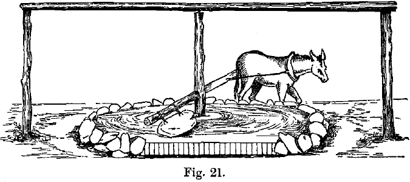
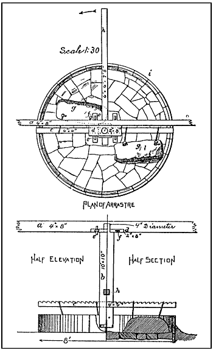

# Arrastra

_Arrastra_ is a mechanical sound installation that uses gears and cogs to activate a music box in the base of the structure. Using the antithesis of the engineer’s simple mechanical system - mechanical _disadvantage_ - the work demands great and coordinated effort from multiple visitors in order for the work to actuate. Modeled after the arrastra, a device used by miners to crush ore by harnessing the power of mules revolving about a bin filled with gold ore, the visitors push a large wooden arm around a base connected with gears to a tiny music box, the gears essentially amplifying the resistance inherent in the music box’s crank. Arrastra investigates the absurdity of process, the interchange of status on a local level, and man as tool.

<d1>
  
</d1>
 

_Arrastra_ does not allow listeners to experience the work unless at least one person pushes against the arm to actuate the device. Friction here is literal and visceral: the sweat on the brow, the grunting, the cursing when only a meager note emanates. It plays the visitor against their environment and the viewer against their own better self. Only sadistic pleasure can be had when the work plays: it is only at the expense of another that they are able to hear it in the first place. Thus, the experience is at once pleasurable and unnerving; for a psychopath, it is pure pleasure.

<d1>
  
</d1>
