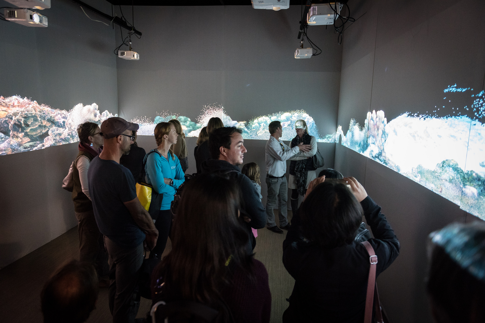
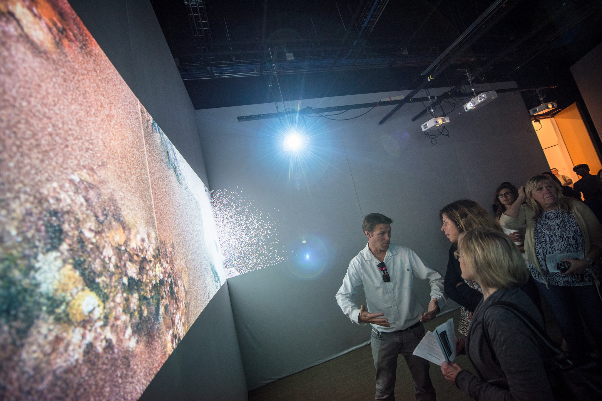
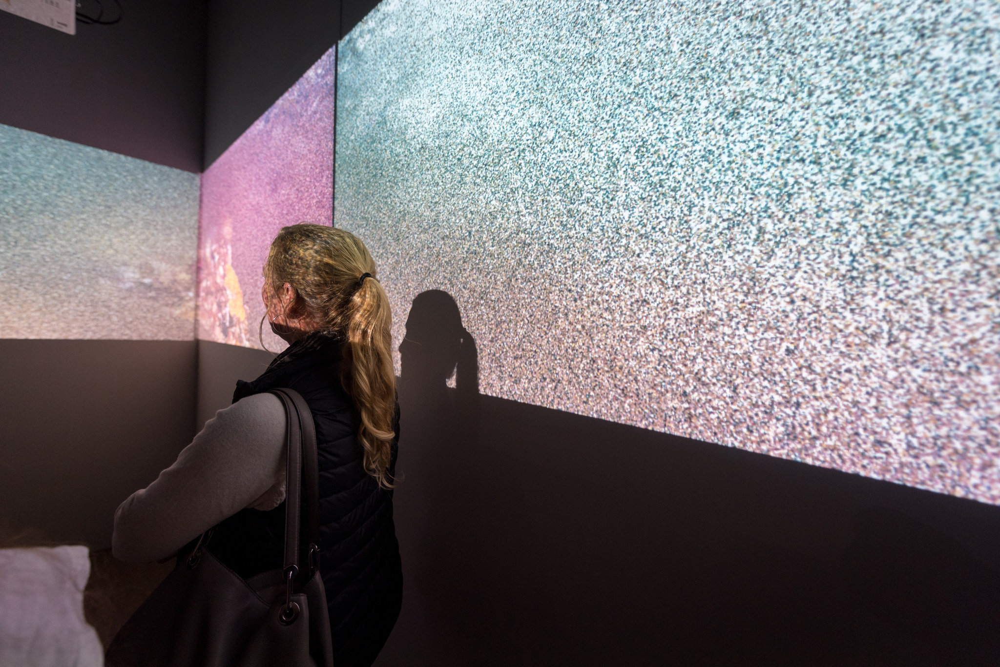
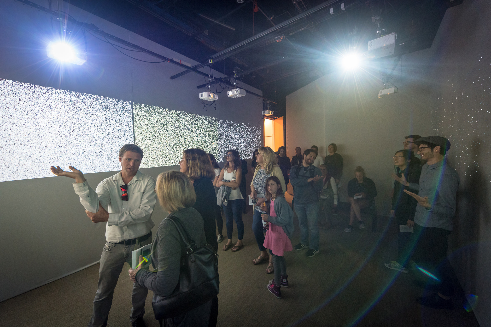

# Erasure (2018)

<d1>
<small>Created in collaboration with Vid Petrovic (computer sciene), Anthony Vine (composition), Fiona Digney (percussion) and with help from the Qualcomm Institute, Cali2, the Cultural Heretidge Engineering Initiative (CHEI), and Scripps' 100 Island Challenge. </small>
</d1>
 

Erasure examines the five stages of grief through the metaphor of the fragility of coral reef ecosystems and the detrimental effects of human impact on these critical environments in an immersive visual and sonic installation. By using an interconnected network of three-dimensional coral reef models and spatially/electronically processed percussion sounds, a metaphorical ecosystem that responds directly to human presence and as a function of the history of that presence throughout the work’s existence, shaping the short- and long-term evolution of the sonic and visual experience.

Erasure responds ‘negatively’ to human presence in the installation environment. As more and more people enter the space, the visual and sonic properties of the installation begin to break down, fracture, and decay. The sonic tapestry of percussion sounds contort and particulate, the synthetic biome of coral visualizations begin to morph into unnatural forms, the entire system mutating with the presence of the audience. The transformation, though, is not irreversible nor unidirectional: as viewers leave, the piece rebounds, albeit slower than the rate at which it was broken. In this way, it provides hope: the system ‘bounces back’ from the immediate and long-term human impact, reflecting the resilience of the reefs to withstand and adapt to global shifts in climate and the ability of humans to survive traumatic events.

In Erasure, the coral reef constructions ebb and flow between their ‘natural state’—meticulously constructed synthetic ecosystems—and transformative states: from granulations of the stony corals and polyps into whirling cascades of particles, to fissions of vast reef colonies into splintered slabs that recede in and out of focus. All the while, lingering traces of the piece in its ‘untouched’ state float amongst the remains, the metaphorical ecosystem dreaming and longing for an undisturbed state.

[more thoughts...](/work/sight/erasure/moreThoughts)

### @ Calit2:
<d1>
  

    

    
    

    

      
    

  

  

    

    
    

    

      
    

  

</d1>

 

### _Exhibition History_

__30.11.2018 - 14.01.2019__ [San Diego Art Institute](https://www.sandiego-art.org/new-events/2018/11/30/rising-tide) as a part of _Rising Tide_ (San Diego, California)

__05.08.2018 - 10.08.2018__: Daegu Art Factory. International Computer Music Conference (Daegu, South Korea)

__11.02.2018__ Premiere as part of the Qualcomm IDEAS Series. Atkinson Hall, Calit2, UCSD (San Diego, California)
