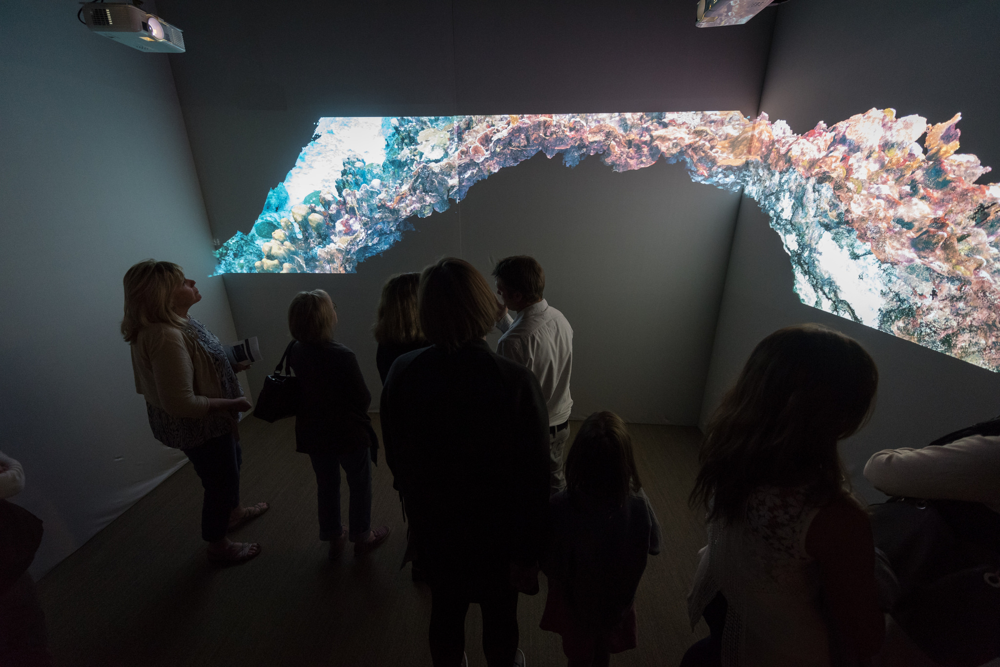
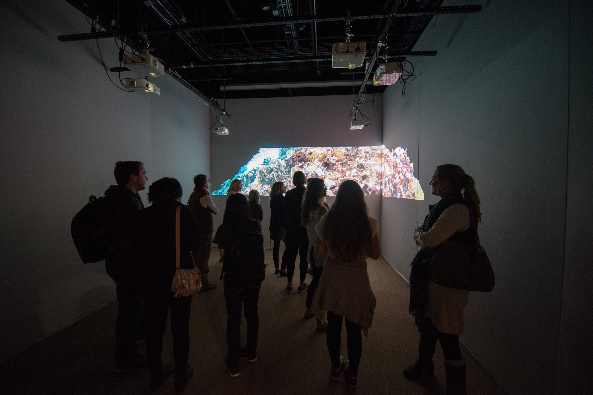

# More thoughts on _Erasure_

Erasure isn’t actually about reefs at all. It rather explores the process of grief; the emotional, intellectual, and social changes that we undergo when confronted with a change in our reality caused by loss. It is the in-between experiences as time accumulates between us and loss, some event that we wish we could erase. People feel distant, their presence needed but often unwanted. True erasure is not possible here: all we can do is scrub until our skin is raw and curse the fact that the loss has permeated us far below the surface. Erasure in this sense is a verb, the act of erasing done in vain until all one can do is accept the fact that the loss has left a permanent mark.

<d1>
  
</d1>  

So you can see that the reef is merely a symbol, a symbol standing in for our own psyche as it writhes and twists, trying to come to terms with our new reality; for our own bodies as we lose sleep, struggling to find a comfortable position we know doesn’t yet exist for us on a bed that is our own but feels unfamiliar.

<d1>
  
</d1>  

The prospects to overcome the loss can seem insurmountable; yet humans, as reefs, persevere. Despite all this about loss and destruction, Erasure is really about hope and regeneration; after all, there is no regeneration without destruction and no hope without fear. Reefs have been around far longer than humans have been and will be here long after we have gone. They have withstood massive shifts in climate and major extinction events only to regenerate, changed, but anew. In the same way, we humans can emerge on the other side of our own private extinction, undoubtedly changed and certainly not unscathed, but new and whole. In time, our bed once again becomes a haven for sleep, rest, and the regeneration we so desperately sought during what seemed an eternal night.
