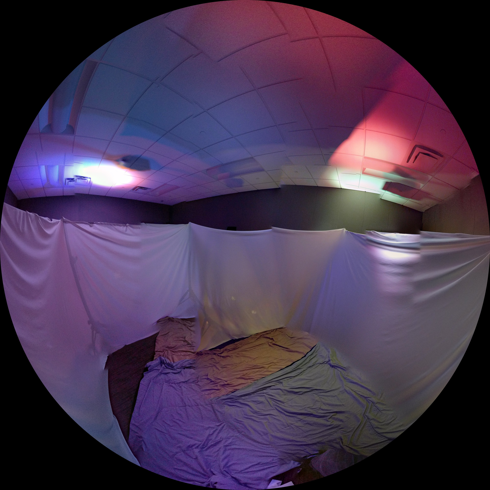
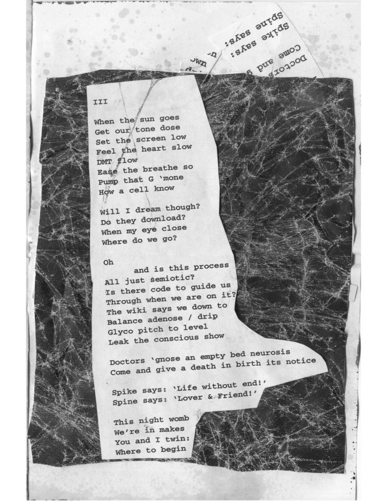

# every once in a while i don't believe you (2017/2018)
&nbsp;&nbsp;&nbsp;&nbsp;<d><smaller>-8-channel sound, LED lights, blankets, pillows, curtains</smaller></d>

<d>
  

    

      <a
      href="../../images/work/everyonceinawhile/panorama.jpg">
        

          
        

        every once in a while i don't believe you ii
      </a>
    

    

      <a
      href="../../images/work/everyonceinawhile/zine.jpg">
        

          
        

        excerpt from zine containing Process S by Medic
      </a>
    

  

    
</d>

An ongoing series of overnight, quasi-realtime performance-installations that turn the bio-potentials of the brain during sleep into sound. Pre-scored, research grade hypnograms and EEG are analyzed analyzed and used to guide the work throughout the night beginning at sundown or ending at sunrise. The pieces last as long as the subject being analyzed sleeps and we follow their sleep patterns throughout the night, wake when they wake, dream when they dream. Participants are invited (encouraged) to bring pillows and/or blankets and to sleep during the performance.

The work uses EEG and hynograms from the [CAP Database](https://physionet.org/physiobank/database/capslpdb/).

### _Performance History_
__13.04.2018__ II. Sunset (7:15pm) to 3:00am. Part of SD Soundings at Conrad Prebys Music Center (La Jolla, California).

__11.02.2017__ I. 9:00pm to 3:00am. Part of Slow SD Music Festival at Conrad Prebys Music Center (La Jolla, California)
