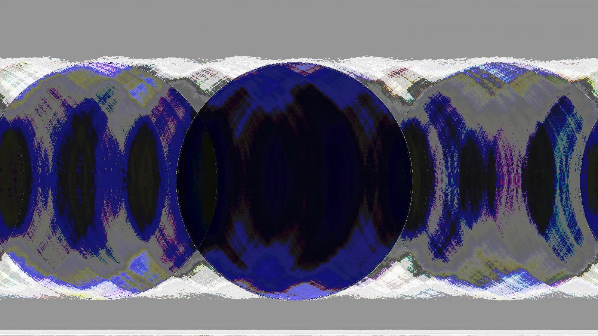

# Stills

Created using a variety of signal processing techniques.

<!-- _tank_ (2015)

_eclipse_ (2015)

_keep me from going crazy_ (2018) -->

<d1>
  

    

      <!-- <a href="../../images/work/stills/keepMeFromGoingCrazy.png">
        
        <figcaption> "keep me from going crazy (2018)"</figcaption>
      </a> -->
      

        
      

      <a href="../../images/work/stills/keepMeFromGoingCrazy.png">
        <figcaption>keep me from going crazy (2018)</figcaption>
      </a>
    

    

      

        
      

      <a href="../../images/work/stills/eclipse.jpg">
        <figcaption>eclipse (2015)</figcaption>
      </a>
    

  

  

    

      

        
      

      <a href="../../images/work/stills/circle.jpg">
        <figcaption>untitled (2018)</figcaption>
      </a>
    

    

      <!-- 

        
      

      <a href="../../images/work/stills/eclipse.jpg">
        <figcaption> "eclipse (2015)"</figcaption>
      </a> -->
    

  

</d1>
